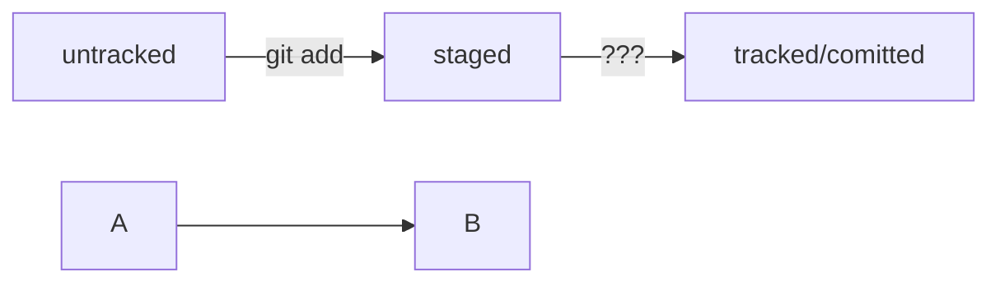

pwd - путь к текущей папке
cd ~ - перейти в домашний каталог
ls - показать содержимое папки
cd [имя папки или путь] - перейти в папку
cd .. - перейти на уровень выше
cd . - обратиться к текущей папке
ls -a - показать содержимое папки, включая скрытое
ls -la - показать содержимое папки списком, включая скрытое
ls ~ - показать содержимое домашнего каталога
ls .. - показать содержимое родительского каталога
touch [имя файла(ов) или путь] - создать файл
mkdir [имя папки или путь] - создать папку
mkdir -p [структура папок] - создать папки согласно структуре
cp [имя файла(ов)] [путь] - скопировать файл
mv [имя файла(ов)] [путь] - переместить файл или папку
cat [имя файла] - прочитать файл
rm [имя файла] - удалить файл
rmdir [имя папки] - удалить пустую папку
rm -r [имя папки] - удалить папку со всем содержимым

git config --global user.name "s1id3r" - добавить имя в конфиг
git config --global user.email e.kozhevnikov@steexport.ru - добавить почту в конфиг
cat ~/.gitconfig - просмотр конфига
git config --list - просмотр конфига

git init - создать локальный репозиторий в текущей папке
rm -rf .git - удалить локальный репозиторий в текущей папке
git status - проверить состояние репозитория
git add --all - добавить все файлы в отслеживание
git add [имя файла] - добавить файл в отслеживание
git add . - добавить в отслеживание всю текущую папку
git commit -m 'Текс сообщения' - сделать коммит с сообщением
git log - просмотреть историю коммитов

ssh-keygen -t ed25519 -C mail@example.com - сгенерировать пару ssh-ключей по алгоритму ed25519
ssh-keygen -t rsa -b 4096 -C mail@example.com - сгенерировать пару ssh-ключей по алгоритму rsa

pbcopy < ~/.ssh/id_ed25519.pub - скопировать содержимое файла в буфер обмена
ssh -T git@github.com - проверить правильность ключа
git remote add origin git@github.com:kind-s1id3r/work-1.git - связать локальный и удаленный репозитории
git remote -v - проверить связанность репозиториев
git push -u origin main - сделать первый пуш
git push - сделать пуш

git log --oneline - просмотреть историю коммитов (одна строка на каждый коммит)

HEAD -- это голова.
Коммит -- это всему голова.
Статусы файлов:

